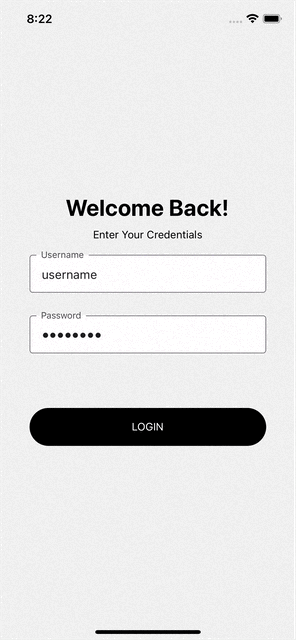

This repo contains the source code for a React Native App built with Expo. This was created as an assignment. 

### How to use
1. Clone the project. 
2. Install dependencies using npm/yarn.
3. Use `npm run ios` or `yarn ios` to run it on IOS device/emulator.

